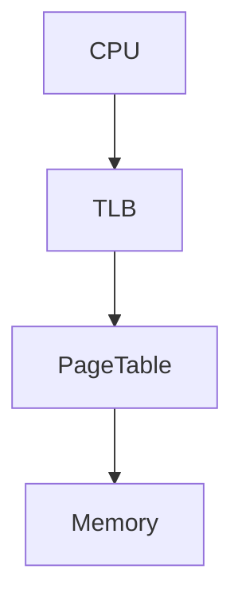

# OS Notes Web 中文编辑方法

这份文档说明如何维护这个操作系统学习笔记站点。你可以把它当作日常编辑手册：新增笔记、整理目录、写题库、使用学习组件、检查格式，都按这里来。

## 一、最常用命令

```bash
npm install
npm run dev
npm run check:docs
npm run typecheck
npm run build
```

- `npm run dev`：本地预览网站。
- `npm run check:docs`：检查文档结构问题。
- `npm run typecheck`：检查 TypeScript 和 Vue 组件类型。
- `npm run build`：构建静态站点。

如果只是写 Markdown，通常只需要：

```bash
npm run dev
npm run check:docs
```

## 二、目录怎么放

所有笔记都放在 `docs/` 下面。

注意：`docs/` 下面的 Markdown 都会成为访客可访问的网页。维护者说明、编辑规范、部署说明这类只给自己看的文档，不要放进 `docs/`，应放在项目根目录。

当前维护者文档包括：

- `EDITING_GUIDE.zh-CN.md`：中文编辑方法。
- `DOC_FORMAT.md`：文档格式约定。
- `DEPLOY_VERCEL.zh-CN.md`：Vercel 部署说明。

推荐结构：

```text
docs/
├─ index.md
├─ format.md
├─ progress.md
├─ tags.md
├─ 内存管理/
│  ├─ main.md
│  ├─ 3_1 存储管理.md
│  └─ 3_2 页式管理基础.md
├─ 进程与线程/
│  ├─ main.md
│  ├─ 4_1 进程状态与控制.md
│  └─ 4_2 线程.md
└─ OS Boot/
   ├─ main.md
   └─ 1_0 引言.md
```

约定很简单：

- `docs/index.md` 必须存在，它是首页。
- 每个章节目录建议有一个 `main.md`，作为章节入口。
- 普通笔记文件可以自由命名，中文文件名可以使用。
- 空文件允许存在，但页面会是空白。
- frontmatter 可写可不写。

## 三、新增一篇笔记

方式一：手动创建 Markdown。

例如新增：

```text
docs/内存管理/3_8 页面置换算法.md
```

最低内容：

```md
# 页面置换算法

## 一句话概括

页面置换算法决定缺页时换出哪一个物理页框。

## 核心内容

- FIFO
- LRU
- Clock
- OPT

## 易错点

- OPT 是理论最优算法，实际系统无法直接实现。
- LRU 关注最近使用时间，不等于使用频率。
```

方式二：使用脚本生成模板。

```bash
npm run new:note -- memory "Page Replacement"
```

注意：脚本更适合英文 slug。如果你想使用中文路径，直接手动新建 Markdown 更直观。

## 四、设置章节顺序和显示名称

侧边栏顺序不依赖文件名前缀编号，而是由项目根目录的 `content-order.json` 控制。

例如：

```json
{
  "top": [
    "knowledge-map.md",
    "tags.md",
    "progress.md"
  ],
  "sections": [
    {
      "dir": "OS Boot",
      "text": "OS Boot",
      "pages": [
        "main.md",
        { "file": "1_0 引言.md", "text": "引言" },
        { "file": "2_0 Boot.md", "text": "Boot" }
      ]
    },
    {
      "dir": "内存管理",
      "text": "内存管理",
      "pages": [
        "main.md",
        { "file": "3_1存储管理.md", "text": "存储管理" },
        { "file": "3_2 页式管理基础.md", "text": "页式管理基础" }
      ]
    }
  ]
}
```

字段说明：

- `top`：控制 `docs/` 根目录下页面的显示顺序。
- `sections`：控制章节目录的显示顺序。
- `dir`：真实目录名，必须和 `docs/` 下的目录名一致。
- `text`：访客看到的章节名称，可以和真实目录名不同。
- `pages`：该章节下页面的显示顺序。可以直接写文件名，也可以写 `{ "file": "真实文件名.md", "text": "访客看到的标题" }`。

如果某个页面没有写进 `pages`，它仍然会显示，只是排在已配置页面之后。

已有文件名里的编号不会作为侧边栏标题展示。例如：

```text
3_2 页式管理基础.md
```

侧边栏会尽量显示为：

```text
页式管理基础
```

更推荐的长期做法是：文件名使用稳定 slug，显示顺序交给 `content-order.json`。

例如：

```text
docs/内存管理/paging.md
docs/内存管理/virtual-memory.md
docs/内存管理/page-fault.md
```

然后在 `content-order.json` 中排序：

```json
{
  "dir": "内存管理",
  "text": "内存管理",
  "pages": [
    "main.md",
    "paging.md",
    "virtual-memory.md",
    "page-fault.md"
  ]
}
```

## 五、推荐页面模板

frontmatter 是可选的，但推荐写，方便标签筛选和复习管理。

```md
---
title: 页面置换算法
tags: [memory, exam, 高频考点]
difficulty: medium
review: 2026-04-17
---

# 页面置换算法

## 一句话概括

一句话说明本页解决什么问题。

## 核心内容

写主要知识点。

## 易错点

写考试和实验里容易错的点。

## 例题

写题目或插入 `<Quiz />`、`<FillBlank />`。

## 代码示例

```c
// 如果没有代码，可以删除本节。
```

## 关联知识

- [分页与 TLB](./3_2 页式管理基础.md)
```

## 六、链接怎么写

优先使用相对链接。

同一目录下：

```md
[页式管理基础](./3_2 页式管理基础.md)
```

跳到上一级再进入其他目录：

```md
[进程与线程](../进程与线程/main.md)
```

链接到首页：

```md
[首页](../index.md)
```

不要手写很长的绝对 URL，后续部署到 GitHub Pages 时更容易出问题。

## 七、如何写标签

标签写在 frontmatter 的 `tags` 字段里。

```md
---
title: TLB 与缺页
tags: [memory, kernel, exam, tricky, 高频考点]
---
```

建议常用标签：

- `memory`：内存管理、页表、TLB、虚拟内存。
- `process`：进程、线程、调度。
- `concurrency`：同步互斥、锁、信号量。
- `kernel`：内核机制、系统调用、中断异常。
- `exam`：真题、考试题型。
- `lab`：实验实现、调试记录。
- `tricky`：容易混淆的概念。
- `高频考点`：需要反复复习的重点。

## 八、如何插入学习组件

### 1. 折叠答案

```md
<Reveal title="答案解析">

这里写详细解析。

</Reveal>
```

适合放例题答案、推导过程、容易剧透的结论。

### 2. 单选题

题目来自 `quizzes/*.json`。

```md
<Quiz collection="memory" />
```

只显示某一道题：

```md
<Quiz collection="memory" question-id="memory-tlb-01" />
```

### 3. 填空题

```md
<FillBlank
  id="page-offset-4k"
  question="页大小为 4 KiB 时，页内偏移占多少位？"
  answer="12"
  explanation="4 KiB = 4096 Byte = 2^12 Byte。"
/>
```

支持多个答案：

```md
<FillBlank
  id="critical-section"
  question="访问共享变量且需要互斥执行的代码区域称为什么？"
  :answer="['临界区', 'critical section']"
/>
```

### 4. 概念对比

```md
<CompareCard
  left-title="TLB miss"
  right-title="Page Fault"
  :left="['TLB 中没有缓存映射', '页面可能仍在内存中']"
  :right="['页表项无效或权限不满足', '通常需要陷入内核处理']"
  summary="TLB miss 是缓存未命中；Page Fault 是地址转换无法继续完成。"
/>
```

### 5. Mermaid 图

````md

````

## 九、如何编辑题库

题库放在 `quizzes/` 下。

例如 `quizzes/memory.json`：

```json
[
  {
    "id": "memory-tlb-01",
    "title": "TLB miss 与缺页",
    "question": "发生 TLB miss 时，下面哪项一定成立？",
    "options": [
      { "label": "A", "text": "该虚拟页一定不在物理内存中" },
      { "label": "B", "text": "需要查询页表或继续完成地址转换" },
      { "label": "C", "text": "一定会触发磁盘 I/O" },
      { "label": "D", "text": "当前进程一定会阻塞" }
    ],
    "answer": "B",
    "explanation": "TLB miss 只表示快表没有缓存该映射，页表项可能仍然有效。",
    "tags": ["memory", "tricky", "exam"],
    "difficulty": "medium"
  }
]
```

题库注意事项：

- `id` 必须稳定，不要随便改，否则本地做题记录会失效。
- `answer` 写选项字母，例如 `A`、`B`。
- `options` 至少建议 4 个。
- `explanation` 一定要写，这是复习价值最高的部分。

如果新增一个题库文件，例如：

```text
quizzes/fs.json
```

还需要在 `components/quizBank.ts` 里导入并注册。

## 十、如何避免 404

最重要的是这几条：

- 不要删除 `docs/index.md`。
- 每个章节目录最好保留 `main.md` 或 `index.md`。
- Markdown 链接尽量使用相对路径。
- 改完路径后运行 `npm run check:docs`。

如果你打开网站看到 404，优先检查：

1. 当前 URL 对应的 Markdown 是否存在。
2. `docs/index.md` 是否存在。
3. 链接里的文件名是否和真实文件名完全一致。
4. 中文路径是否被浏览器或编辑器错误转码。

## 十一、推荐编辑流程

每次整理笔记时，可以按这个顺序：

1. 在 `docs/` 中找到对应章节目录。
2. 如果是新章节，先创建 `main.md`。
3. 新建或编辑具体知识点 Markdown。
4. 给重要页面补 `title` 和 `tags`。
5. 有例题就用 `<Reveal />`、`<Quiz />` 或 `<FillBlank />`。
6. 运行 `npm run check:docs`。
7. 本地运行 `npm run dev` 预览。

## 十二、当前项目对格式的态度

这个项目故意把格式要求设计得很宽松：

- 不强制 frontmatter。
- 不强制英文路径。
- 不强制每页都使用固定模板。
- 不强制必须写组件。

真正强制的只有一件事：`docs/index.md` 必须存在。这样可以最大限度保护你的原始 Markdown 笔记资产，不让笔记被框架绑死。
