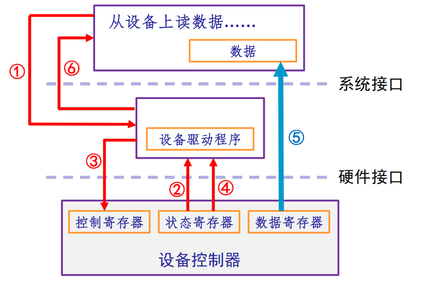
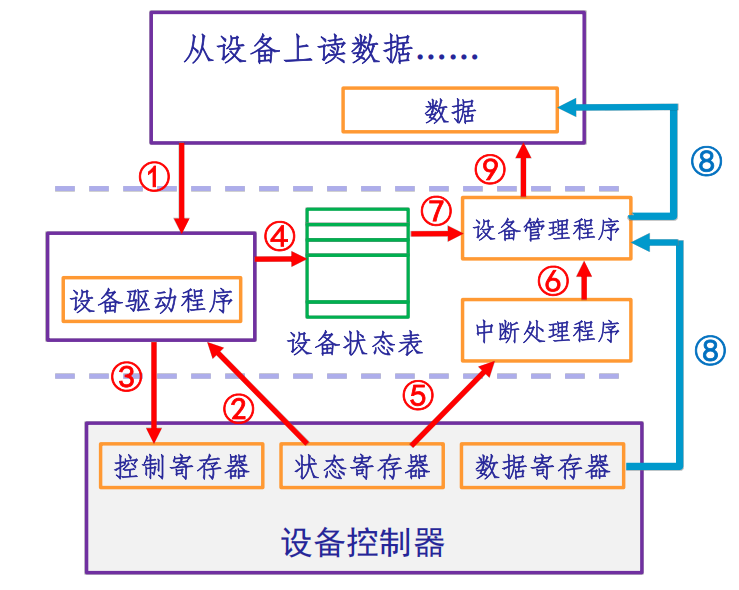
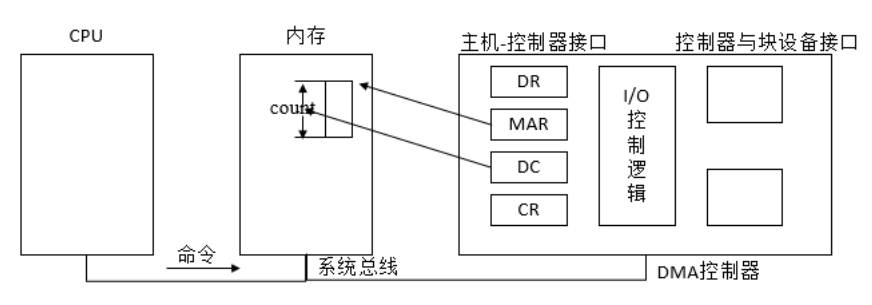
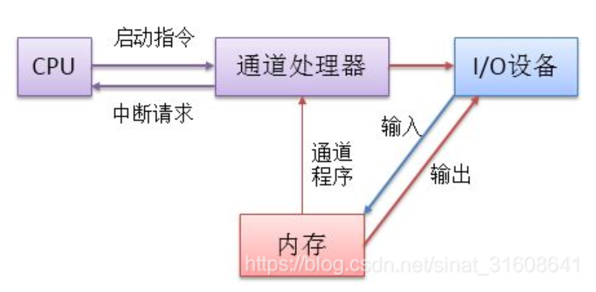
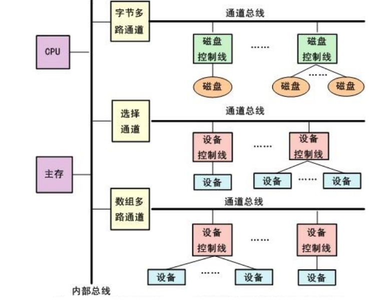

## I/O控制方式

> [!NOTE]
>
> **I/O控制方式**
>
> + **程序控制I/O（PIO,Programmed I/O）：**轮询，发出请求后忙等，I/O完成后继续执行
> + **中断驱动方式（Interrupt-driven I/O）：**I/O结束后由设备通知驱动程序期间别的程序可运行
> + **直接存储访问方式（DMA, Direct Memory Access）：**用专门的控制器完成内存与设备的数据传输
> + **通道技术（Channel）：**由一个特殊功能的处理器（通道）负责数据I/O的传输控制，和DMA原理类似

下面以图示方式介绍每种方式的过程，如果能只看图讲清楚流程，那么你就学会了！

### 程序控制I/O

**工作过程：**

① 应用程序发出I/O请求

② 设备驱动检查设备状态

③ 设备驱动设置控制寄存器，设备开始工作

④ 设备驱动不断轮询检查状态寄存器，直到I/O完成，状态修改

⑤ 设备完成操作，CPU控制传输数据

⑥ 结束I/O过程，继续执行后续程序

---

### 中断驱动

**工作过程：**

① 应用程序发出I/O请求

② 设备驱动检查设备状态

③ 设备驱动设置控制寄存器，设备开始工作

④ 将设备状态记录在表，CPU执行其他工作

⑤ 设备完成操作，发出中断信号，转入中断处理

⑥ 中断处理检查信号正常，交接给设备管理程序

⑦ 设备管理程序从表中查询相关信息

⑧ CPU控制传输数据

⑨ 通知应用程序可继续进行

---

### 直接存储访问

**工作过程：**

1. 由程序设置DMA控制器中的若干寄存器值（如内存始址，传送字节数），然后发起I/O操作；

2. DMA控制器完成内存与外设的成批数据交换；

3. 在**操作完成时**由DMA控制器向CPU发出中断。

**寄存器含义：**

+ DR：暂存数据
+ DC：记录读写数据的量
+ MAR：记录要写入（或写出）的数据内存地址
+ CR：设置状态，或反映当前状态

> [!TIP]
>
> DMA流程上和中断方式有点像，主要区别如下：
>
> 1. **单位不同：**中断方式在每个单位数据传送完成就发出中断信号，DMA则为一批
> 2. **CPU干预程度不同：**中断方式的数据传输由CPU控制，而DMA只在传输完通知CPU
> 3. **处理异常的能力：**中断方式有处理异常事件能力，DMA较死板，适合数据块传输

---

### I/O通道控制

**基本思想：**进一步减少CPU干预

> [!TIP]
>
> I/O通道和DMA有如下区别：
>
> 1. **CPU干预程度不同：**DMA需要CPU去设置数据传输方向、存放数据的内存地址和数据块长度等参数；而通道技术把这些写在通道程序里面让通道处理器执行即可
> 2. **并发性不同：**DMA只能控制一台或少数几台同类设备；而一个通道可控制多种设备
>
> DMA像自动化机器。机器会自己完成数据搬运，但你仍需要亲自接通、设置地址和长度、选择模式并启动。
>
> 当设备很多、任务复杂时，CPU如果还要逐项配置，仍会浪费不少时间。
>
> 通道则像专门负责操作这些机器的员工。CPU只需准备一份通道程序并启动通道，通道就会按计划控制设备、完成多次传输，最后再通知CPU。

**通道分类：**

+ **字节多路通道：** 
  + 以字节为单位交叉工作：
  + 当为一台设备传送一个字节后，立即转去为另一它设备传送一个字节；
  + 适用于连接打印机、终端等低速或中速的I/O设备。
+ **数组选择通道：** 
  + 以“组方式”工作，每次传送一批数据，传送速率很高，但在一段时间只能为一台设备服务。每当一个I/O请求处理完之后，就选择另一台设备并为其服务；
  + 适用于连接磁盘、磁带等高速设备。
+ **数组多路通道**
  + 综合了字节多路通道分时工作和选择通道传输速率高的特点；
  + 其实质是：对通道程序采用多道程序设计技术，使得与通道连接的设备可以并行工作。

---

| 方式        | 核心                                                         | 优点                                                    | 缺点                                                         |
| ----------- | ------------------------------------------------------------ | ------------------------------------------------------- | ------------------------------------------------------------ |
| 程序控制I/O | CPU轮询直到I/O完成                                           | 简单                                                    | CPU占用时间很长                                              |
| 中断处理    | 可执行其他程序直到I/O完成发出中断信号才处理                  | 1. 减少轮询占用CPU的时间 2. 可灵活处理异常事件       | CPU占用时间较长                                              |
| DMA         | 由专门DMA控制器完成数据传输，只需开始时设置寄存器、结束时唤醒 | CPU只干预I/O开始和结束后续成批数据无需CPU，适合高速设备 | 1.数据方向、存放数据的内存地址、数据量等由CPU控制，占用时间 2.每个设备需要相应的DMA资源，设备增加时需增加DMA |
| 通道        | 由专门的通道处理器根据给定的通道程序执行完成I/O              | 执行一个通道程序可以完成几组I/O操作，减少CPU干预        | 费用较高                                                     |

从上至下是不断将I/O从CPU解耦到其他模块的过程，CPU干预程度不断下降，但硬件层也变复杂，成本升高

## 复习题

<QuizSet collection="final-review" />
