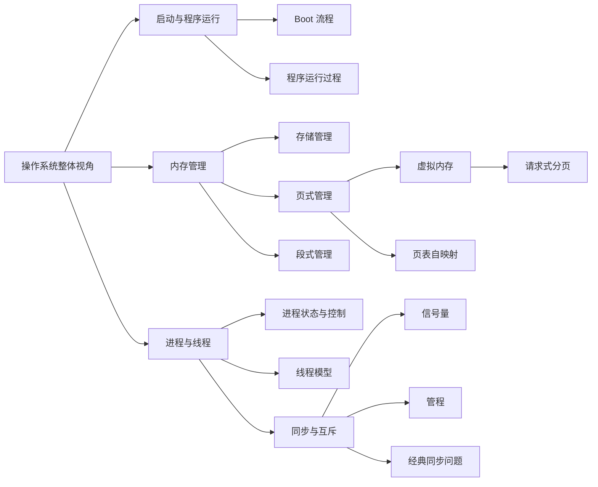

# Knowledge Map

  
知识地图用来定位概念之间的依赖关系。复习时可以先看主干，再回到具体章节补细节和做练习。

## 模块索引

  <a class="os-card" href="./OS%20Boot/main">
    启动主线
    <strong>OS Boot</strong>
    
适合在学习内存和进程之前先建立系统启动与程序执行的整体背景。

  </a>
  <a class="os-card" href="./%E5%86%85%E5%AD%98%E7%AE%A1%E7%90%86/main">
    地址主线
    <strong>内存管理</strong>
    
从地址转换进入分页、虚拟内存、缺页异常和页表自映射。

  </a>
  <a class="os-card" href="./%E8%BF%9B%E7%A8%8B%E4%B8%8E%E7%BA%BF%E7%A8%8B/main">
    并发主线
    <strong>进程与线程</strong>
    
从进程状态出发，连接线程实现、同步互斥和经典并发问题。

  </a>

