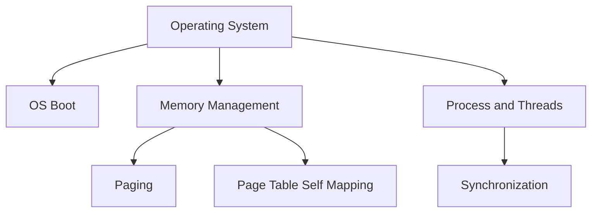

# Knowledge Map

```mermaid
flowchart TD
  OS[Operating System] --> Boot[OS Boot]
  OS --> Memory[Memory Management]
  OS --> Process[Process and Threads]
  Memory --> Paging[Paging]
  Memory --> SelfMapping[Page Table Self Mapping]
  Process --> Sync[Synchronization]
```

## Sections

- [OS Boot](./OS%20Boot/main.md)
- [Memory Management](./内存管理/main.md)
- [Process and Threads](./进程与线程/main.md)
