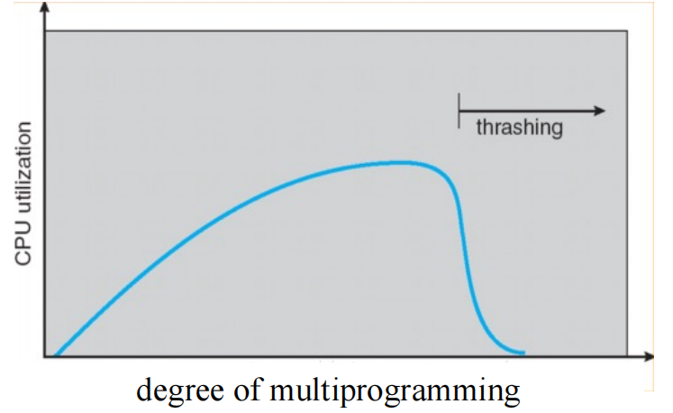
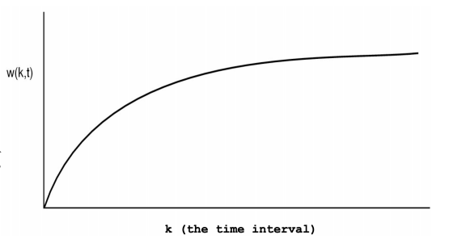
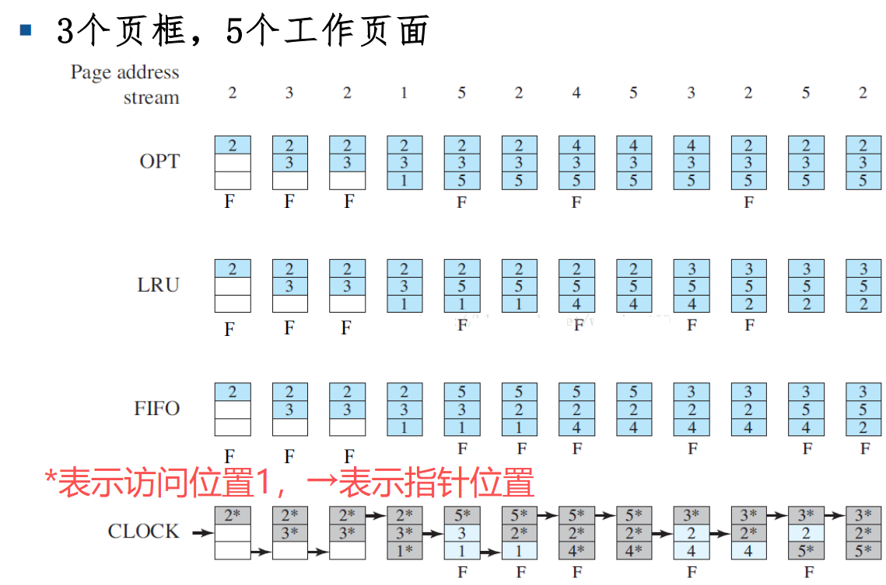

# ==请求式分页系统==

> [!NOTE]
>
> + **进程的逻辑地址空间（虚拟地址空间）：**
> + 一个进程的逻辑空间的建立是通过链接器（Linker），将构成进程所需要的所有程序及运行所需环境，按照某种规则装配链接而形成的一种规范格式(布局)
> + **交换分区（交换文件）：**
> + 一段连续的磁盘空间（按页划分的），并且对用户不可见。它的功能就是在物理内存不够的情况下，操作系统先把内存中暂时不用的数据，存到硬盘的交换空间，腾出物理内存来让别的程序运行（Linux中为swap，Windows中则以文件`pagefile.sys`形式存在）

## 地址映射

​							   **请求式分页管理页表表项**

逻辑页号								

↓

$i$

| 访问位 | 修改位 | 保护位 | 驻留位 | 物理页帧号 |
| ------ | ------ | ------ | ------ | ---------- |

+ **驻留位（Present）：** 1表示该页位于内存当中；0表示该页当前还在外存当中。

+ **保护位：** 只读、可写、可执行。

+ **修改位（Dirty）：** 表明此页在内存中是否被修改过。

+ **访问（统计）位（Accessed）：** 用于页面置换算法。

常见分配：

+ 用户可执行文件以文件形式存储在硬盘中
+ 堆栈在磁盘上没有对应文件，地址为空
+ 未分配部分没有对应页表项，申请时才会建立相应页表项

## 页面调入策略

**核心思想：** 只需把**当前需要的部分页面**调入主存

+ 调入什么：OS核心部分、正在运行的用户进程相关程序和数据
+ 何时调入：OS在系统启动时调入；用户程序取决于调入策略（预调页，按需调页，$\dots$）
+ 如何调入：缺页错误处理机制

### 按需调页（请求式调页）

需要某页时调入，进程执行时使用懒惰交换（直到要用到了再写入）；外存保护不再内存中的页

### 预调页

可以通过所需要的页一起调入内存，减少缺页错误的数量，增加了效率

实际应用中可以为当前进程维护一个工作集，如果进程暂停后重启根据工作集一次性调入。

当然如果程序局部性较差，则会降低系统效率

## 缺页错误（Page Fault）处理过程

1.  **现场保护：** 陷入内核态，保存必要信息（OS 及用户进程状态相关）
2.  **页面定位：** 查找出发生缺页异常的虚拟页面，通常保存在一个硬件寄存器中，否则需要检索程序计数器，取出指令，用软件分析
3.  **权限检查：** 检查虚拟地址的有效性及安全保护位，若发生保护错误，杀死该进程
4.  **新页面调入：** 查找一个空闲物理页框调入；如果没有空闲页框则需要通过页面置换算法找出一个需要换出的页框
5.  **旧页面写回：** 若找到的页框被修改了，需要写回到磁盘上
6.  **新页面调入：** 找到的页框无有效映射后，将保存在磁盘上的页面内容复制到该页框中
7.  **更新页表：** 页面内容全部装入页框后，发送一个中断，更新页表项的物理页框号和状态
8.  **恢复现场：** 恢复缺页异常发生前的状态，将程序指针 **重新指向引起缺页异常的指令** 
9.  **继续执行：** 重新执行引发缺页异常的指令，进行存储访问。

## 页面分配策略

### 工作集与驻留集管理

**工作集：** 进程运行正在使用的页面集合

**驻留集：** 虚拟存储系统中，每个进程驻留在内存的页面集合，或进程分到的物理页框集合 （工作集 $\in$ 驻留集）

**影响页框分配的主要因素：**
+ 分配给每个活动进程的页框数越少，能够驻留内存的活动进程数就越多，进程调度程序能调度就绪进程的概率就越大，然而，这将导致进程发生缺页异常的概率较大；
+ 为进程分配过多的页框，并发运行的进程数降低，影响系统资源利用率。

### 页面分配策略-固定分配策略

为每个活动进程分配固定数量的页框。即每个进程的驻留集大小在运行期间固定不变。

分多少？

+ 系统根据进程类型
+ 编程人员或系统管理员指定

不够怎么办？

只能从分给该进程的内存块中进行页面置换

### 页面分配策略-可变分配策略

可根据进程的缺页率调整进程的驻留集
+ 缺页率很高时，驻留集太小，需增加页框
+ 当缺页率一段时间内都保持很低时，可以在不会明显增加进程缺页率的前提下，回收其一部分页框，减小进程的驻留集

**特点：**
+ 灵活，吞吐量高，有效利用内存
+ 要求统计缺页率，增加开销；且阈值确定较复杂
+ 需要操作系统软件和处理机平台硬件的支持

### 内存块初始分配方法

**等分法：** 为每个进程分配存储块的最简单的办法是平分，即若有m块、n个进程，则每个进程分m/n块（其值向下取整）

**比例法：** 分给进程的块数=（进程地址空间大小/全部进程的总地址空间）*可用块总数

**优先权法：**为加速高优先级进程的执行，可以给高优先级进程分较多内存。如使用比例分配法时，分给进程的块数不仅取决于程序的相对大小，而且也取决于优先级的高低。

### 抖动问题(thrashing)

随着驻留内存的进程数目增加，即进程并发程度的提高，处理器利用率先上升，然后下降。

+ 第一段：并发度上升，处理器利用率增加
+ 第二段：驻留集小于工作集后，缺页率急剧上升，频繁调页使得调页开销增大

**抖动问题的消除与预防：**
+ 局部替换策略：将抖动局限于进程的驻留集内，不影响其他进程，未解决问题，只是减小影响
+ 工作集算法：[下文](#工作集算法)提到，减小缺页率
+ 预留部分页面：减小缺页率
+ 挂起若干进程：减小并发度，让抖动进程回归正常

## 页面置换和页面置换策略

**问题：** 当发生缺页异常时
+ 在什么范围判断已经没有空闲页框？
+ 如果指定范围没有空闲页框，应该选什么页面移出内存？

### 置换范围

**局部置换策略：** 系统在进程自身的驻留集中判断当前是否存在空闲页框，并在其中进行置换。

**全局置换策略：** 在整个内存空间内判断有无空闲页框，并允许从其它进程的驻留集中选择一个页面换出内存。
+ 问题：无法控制缺页率。进程缺页率和其他进程有关，受外部影响大

### 选页

**选页标准：** 减少页面换入换出频率；选择替换页面的过程复杂度低

**常用方法：** 

+ 最优置换（OPT）：算法将内存中的页 P 置换掉，页 P 满足：从现在开始到未来某刻再次需要页P，这段时间最长。也就是 OPT 算法会**置换掉未来最久不被使用**的页。因为需要知道未来的使用情况，**实际上无法实现**，只能作为一种比较标准。
+ 先进先出（FIFO）：系统记录每个页被调入内存的时间，当必需置换掉某页时，**选择最旧的页换出**。性能较低，会出现 Belady 现象。
+ 最近最少使用（LRU）：原理是最近访问的页面未来被访问的概率会更高（局部性原理）。开销较大，有近似算法。

> [!NOTE]
> **Belady 现象与改进方案**
> Belady’s Anomaly: 在使用FIFO算法作为缺页置换算法时，随着分配的页框增多，缺页率反而提高
> 其出现的原因是决策因素只考虑第一次出现的时间，但是与实际出现频率等无关，违背了局部性原理
> **改进方案：**
> + Second Chance: 增加一个标志位，如果添加后再被访问过，则要被置换时考虑再给一次机会，移除并放在队尾
> + Clock: Second Chance 的环形队列改进，避免将数据在FIFO队列中移动

> [!NOTE]
> **LRU 的实现：**
> + 一种软件的实现方法：链表法
> + 一种硬件的实现方法：计数器
> + 一种近似算法：老化算法（AGING）

### 工作集算法

随着程序运行当内存访问的局部性区域的位置大致稳定时，工作集大小也大致稳定

局部性区域的位置改变时，工作集快速扩张和收缩过渡到下一个稳定值

**算法：** 记录进程的工作集，优先选择不在工作集的页面替换

**挑战：** 工作集的确定，精确记录困难，粗糙集合太大，且工作集也未必能准确反映未来情况

### 替换策略具体实现

以下是总结，需要**注意实现过程**

|算法|实现|效果|
|---|---|---|
|OPT|无法实现，作为标准|最理想|
|FIFO|新访问的页面插入FIFO队列尾部，页面在FIFO队列中顺序移动；需要置换时淘汰FIFO队列头部的页面；|最简单，效果最差，会出现Belady现象|
|Second Chance|每个页面增加一个访问标志位，用于标识此数据装入内存后是否被再次访问过。需要置换时从队头扫描，并对标识位为 1 的页置为 0 ，直到找到标识位为 0 ，如果找到队尾都没有，则在扫描一次（按照 FIFO 原则）|效果比 FIFO 好，但代价和复杂度比较大|
|Clock|Second Chance 的循环队列改进，注意使用了一个指针，每次找替换页不是从头开始，而是从指针位置开始|效果和 Second Chance 相同，代价和复杂度比较小|
|LRU 链表实现（软件）|每次访问页面时若链表内不存在则创建，若链表内存在则取出插入到头部，每次淘汰尾部|开销大，效果好|
|LRU 计数器实现（硬件）|设置指令计数器，每个页面在被访问时读取计数器，并记录相应数值（指令运行的时间戳）。淘汰计数值最小的页面。|开销大，效果好|
|Aging|为每个页面设置一个移位寄存器，每隔一段时间，所有寄存器右移1位，并将访问位 R 值从左移入。淘汰寄存器中数值最小的页面。|效果与 LRU 相近，开销较小|

## 更新问题

在虚存系统中，主存作为辅存（磁盘）的高速缓存，保存了磁盘信息的副本。因此，当一个页面被换出时，为了保持主辅存信息的一致性，必要时需要信息更新：
+ 若换出页面是file backed类型，且未被修改，则直接丢弃，因为磁盘上保存有相同的副本。
+ 若换出页面是file backed的类型，但已被修改，则直接写回原有位置。
+ 若换出页面是anonymous类型，若是第一次换出或已被修改，则写入swap区;若非第一次换出且未被修改,则丢弃。

