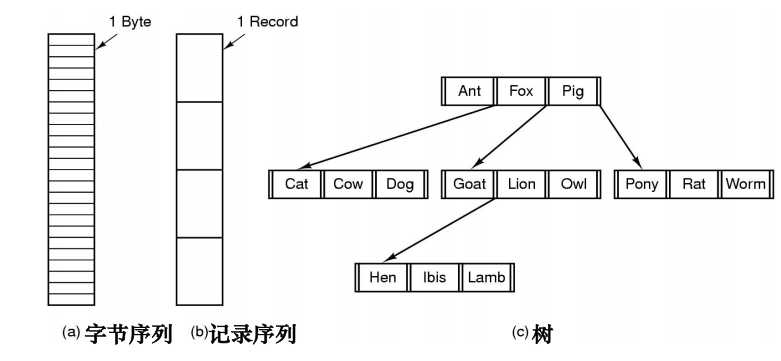

## 从问题谈起

内存空间保存数据的问题：

+ 内存大小有限
+ 进程运行结束后数据丢失（易失性）
+ 多个进程可能需要共享数据

因此，有些数据必须保存在磁盘、光盘等外部存储设备上

但多种设备太过复杂，我们需要**向用户屏蔽访问数据的复杂**，并且**提高外存资源利用率、优化性能**，所以需要建立一种逻辑抽象，便于OS管理

这个逻辑抽象，就是文件

> [!TIP]
>
> 类比：进程-CPU、地址空间-内存、文件-磁盘

## 基本概念

> [!IMPORTANT]
>
> **一切皆文件——Unix 的统一 I/O 设计思想。**
>
> 文件实质上是一组字节序列，带有标识、逻辑上具有完整意义的信息项
>
> 所有IO设备都可以看作是文件，进程间通信使用的通道也是文件，目录也是一种文件
>
> - 文件体：实际内容；
> - 文件说明：文件名、类型、大小、权限、位置、时间等元数据。

**用户**关心文件中的数据，并要求提供相关接口（如创建、打开、关闭、读、写等）

**操作系统**关心如何管理好物理文件，需要文件的描述和分类，包括文件存储位置、设备管理接口等

文件系统是操作系统中统一管理信息资源的一种软件。

文件系统需要实现的功能：

1. 统一管理磁盘空间，实现磁盘空间的分配与回收

2. 实现文件按名存取：名字空间--映射-->磁盘空间；

3. 实现文件信息共享，并提供文件的保护、保密手段；

4. 向用户提供一个方便使用、易于维护的接口，并向用户提供有关统计信息；

5. 提高文件系统的性能；

6. 提供与IO系统的统一接口。

---

### 文件的逻辑结构

**用户视角下的文件**

三种逻辑结构：

以字节为单位的流式结构、记录式文件结构，和树形结构

除此以外，还可以组织成堆、顺序、索引、散列等结构

---

### 目录

目录是由文件说明索引组成的用于文件检索的特殊文件，其功能为：

+ 方便用户组织、分类
+ 方便需要访问文件时快速定位到相应文件（树形结构减少复杂度）

其内容包括：

+ 基本信息：文件名、别名
+ 文件类型：结构、内容、用途、属性、文件组织方式等
+ 地址信息：存储位置、文件长度
+ 访问控制信息：所有者、访问权限
+ 使用信息：创建时间、最后一次读时间和用户、最后一次写时间和用户

逻辑上，目录需要提供文件名及其文件说明信息；具体实现中，可以直接保存 FCB，也可以只保存指向 FCB/inode 的编号或指针。

| 结构     | 优点                                                         | 缺点                                               |
| -------- | ------------------------------------------------------------ | -------------------------------------------------- |
| 单级目录 | 结构简单                                                     | 文件多时检索时间长 有命名冲突 不便于实现共享 |
| 多级目录 | 层次清晰，便于用户查找 可解决文件重名问题 每级只查找一个子集，查找速度相对较快 | 目录级别太多时，会增加路径检索时间                 |

## 复习题

<QuizSet collection="final-review" />
