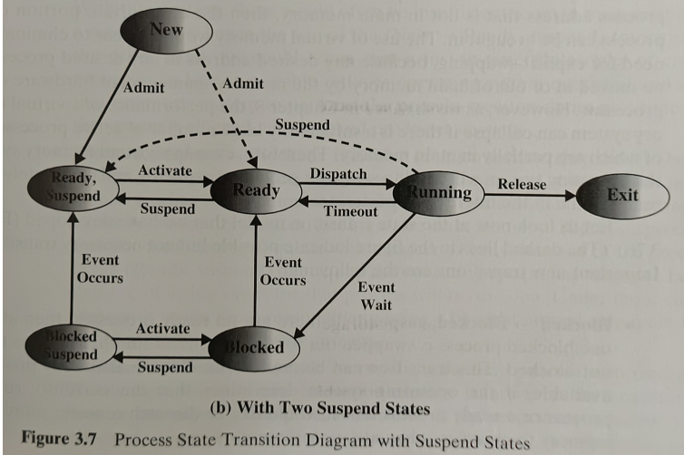

# 进程状态与控制

> Talk is cheap. Show me the code.												—— Linus Torvalds（Linux 创始人）

## 进程的引入

**问题：**少核（比如单核）要在同时处理多个任务

**解决方式：** 并发运行！

> [!CAUTION]
> **并发与并行**
> 并发Concurrent：若干个程序（或程序段）同时在系统中运行，它们的执行在时间上是重叠的。
> 并行Parallel：在同一时间度量下运行在不同的处理机上

程序并发执行时的特征
+ **间断性：**并发程序具有“执行---暂停----执行”这种间断性的活动规律。
+ **非封闭性：**多个程序共享系统中的资源，这些资源的状态将由多个程序来改变，致使程序之间相互影响。
+ **不可再现性：**在初始条件相同的情况下，程序的执行结果依赖于执行的次序。

**Bernstein条件：** 

$$进程 S_1 和 S_2 并发执行可复现 \Leftrightarrow (R(S_2)\bigcap W(S_1)=\emptyset) \wedge (R(S_1)\bigcap W(S_2)=\emptyset)(\wedge W(S_1)\bigcap W(S_2)=\emptyset)$$

## 进程

> [!NOTE]
> 进程是程序的一次执行；
> 进程是可以和别的计算并发执行的计算；
> 进程可定义为一个数据结构，及能在其上进行操作的一个程序；
> 进程是一个程序及其数据在处理机上顺序执行时所发生的活动；
> **进程是程序在一个数据集合上运行的过程，它是系统进行资源分配和调度的一个独立单位。**

进程是动态的，而程序是静态实体

**结构特征：** 程序、数据、进程控制块PCB

## 进程的状态与控制

**主要任务：** 创建和撤消进程，以及实现进程的状态转换（OS实现）

进程的创建： 可能发生在提交一个批处理作业、用户登录、由OS创建，用以向一个用户提供服务、由已存在的一进程创建等场景

进程的撤销： 可能发生在用户退出登录、进程执行一个中止服务的请求、出错及失败因素、正常结束、给定时限到等场景

> [!NOTE]
> **原语（Primitive）：**由若干条指令所组成的指令序列，来实现某个特定的操作功能（连续不可分割的，OS核心，必须内核态执行，常驻内存，**不可中断**）

### 进程的状态
+ 就绪状态：进程已获得除处理机外的所需资源，等待分配处理机资源；只要分配CPU就可执行。
+ 执行状态：占用处理机资源；处于此状态的进程的数目小于等于CPU的数目。在没有其他进程可以执行时（如所有进程都在阻塞状态），通常会自动执行系统的idle进程（相当于空操作）。
+ 阻塞状态：正在执行的进程，由于发生某种事件而暂时无法执行，便放弃处理机处于暂停状态。
+ 挂起状态：被换出到外存，暂停执行。分为就绪挂起和阻塞挂起。

### 进程的控制

> [!NOTE]
> **进程控制块PCB**
> 每个进程有一个，是进程管理与控制的最重要数据结构
> 
> **作用：**
> + 进程创建、撤消；
> + 进程唯一标志；
>
> **内容：**
> + 进程标识符:每个进程特有的唯一的标识符
> + 程序和数据地址：把 PCB 与其程序和数据联系起来。
> + 当前状态：方便 OS 根据状态管理
> + 现场保护区: 当进程因某种原因不能继续占用CPU时，保存CPU的各种状态信息，为将来再次得到处理机CPU恢复做准备
> + 同步与同步机制：用于实现进程间互斥、同步和通信所需的信号量等。
> + 优先级：进程的优先级反映进程的紧迫程度
> + 资源清单：列出所拥有的除CPU外的资源记录，如拥有的I/O设备、打开的文件列表等。
> + 链接字：PCB链接字指出该进程所在队列中下一个进程PCB的首地址。
> + 其他信息：如进程记账信息，进程占用CPU的时间等。

PCB常见的组织方式有线性表、索引方式、链接方式

> [!IMPORTANT]
> **进程上下文切换 vs 陷入内核**
> **进程上下文切换（Process Context Switch）**
> + 通常由调度器执行
> + 保存进程执行断点
> + 切换内存映射（页表基址、flush TLB）
> **陷入/退出内核（也称为模态切换, Mode Switch）**
> + CPU状态改变
> + 由中断、异常、Trap指令（系统调用）引起
> + 需要保存执行现场（寄存器、堆栈等）
>
> 系统调用涉及到进程从用户态到内核态的切换（mode switch），这个时候涉及到的切换主要是寄存器上下文的切换，和通常所说的进程上下文切换（Process Context Switch）不同，mode switch 的消耗相对要小很多。

## 交互式复习题

<Quiz collection="process" question-id="process-state-control-01" />

<Quiz collection="process" question-id="process-state-control-02" />

<Quiz collection="process" question-id="process-state-control-03" />

<Quiz collection="process" question-id="process-state-control-04" />

<Quiz collection="process" question-id="process-state-control-05" />

<Quiz collection="process" question-id="process-state-control-06" />

<Quiz collection="process" question-id="process-state-control-07" />

<Quiz collection="process" question-id="process-state-control-08" />

<Quiz collection="process" question-id="process-state-control-09" />

<Quiz collection="process" question-id="process-state-control-10" />

<Quiz collection="process" question-id="process-state-control-11" />

<Quiz collection="process" question-id="process-state-control-12" />

<Quiz collection="process" question-id="process-state-control-13" />

<Quiz collection="process" question-id="process-state-control-14" />

<Quiz collection="process" question-id="process-state-control-15" />
