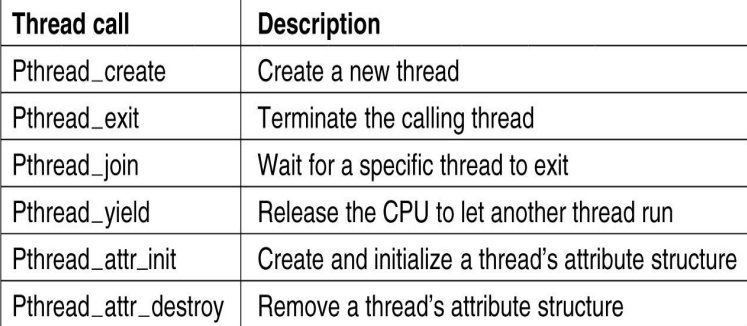
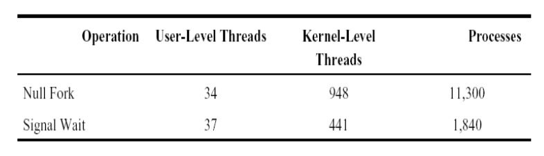

# 线程

**进程的问题：** 不同进程间通信（互换数据）开销大，无法有效处理需要紧密协作的多任务。

## 线程的提出

实际上，进程包含了两个概念
• 资源拥有者
• 可执行单元

现代操作系统将资源拥有者称为进程（process, task），将可执行单元称为线程（Thread）。

**多线程的优势：**
+ 并发粒度更细（任务级并行）、并发性更好，线程可提高进程内的并发程度
+ 线程间可以共享资源，例如运行状态、上下文（如：程序计数器）、执行栈
+ 由于资源共享，有效减少了创建/撤销/切换/同步等所造成的开销，创建一个线程比一个进程快 10-100 倍
+ 对于**存在大量计算和大量I/O处理**的应用，大幅度提高性能

> [!CAUTION]
> **多线程的弱势场景**
> 使用多线程主要是为了让那些不需要依赖 I/O 等条件就能执行的任务，在需要等待 I/O 等条件的任务被阻塞时，仍然能够运行，不浪费 CPU 资源
> 当**I/O 等处理很少**的情况下，多线程相比单线程并没有很大优势，反而可能因为线程的创建、切换、撤销等需要一定时间而性能下降

## 线程的实现方式

**分类：**

+ 用户级线程：User level threads(ULT)
+ 内核级线程：Kernel level threads (KLT)
+ 混合实现方式

### 用户级线程

线程在用户空间,通过用户态线程库 library 模拟的 thread ,不需要或仅需要极少的 kernel 支持

上下文切换比较快,因为不用更改 page table 等,使用起来较为轻便快速

提供操控视窗系统的较好的解决方案

POSIX Pthreads：用于线程创建和同步的 POSIX 标准 API(IEEE 1003.1c)

**优点：**

1. 线程切换与内核无关
2. 线程调度由应用决定，容易优化
3. 可运行在任何操作系统上，只要线程库支持

**缺点：**

1. 很多系统调用会引起阻塞，而系统会因此阻塞这个进程的所有用户级线程
2. 内核只能把处理器分配给进程，即使有多个处理器也无法实现一个进程中的多个线程并行执行

### 内核级线程

内核级线程就是 kernel 有好几个分身,一个分身可以处理一件事

这用来处理非同步事件很有用, kernel可以对每个非同步事件产生一个分身来处理

支持内核线程的操作系统内核称作多线程内核

**优点：**

1. 内核可以在多个处理器上调度一个进程的多个线程实现同步并行执行
2. 阻塞发生在线程级别
3. 内核可以实现一些多线程处理

**缺点：**

1. 一个进程中的线程切换需要内核参与，线程的切换涉及到两个模式的切换（进程-进程、线程-线程）
2. 内核级线程的管理开销大于用户级线程，因此操作效率较低；但在阻塞频繁或需要并行处理的环境中，其调度性能和吞吐能力更优。

**线程操作的延迟-μs**

### 用户级线程和内核级线程的比较

+ **OS 感知性：**内核级线程是 OS 内核可感知的；用户级线程是 OS 内核不可感知的（可感知意味着内核知道存在并将其作为管理对象）
+ **实现方：**用户级线程由语言或者用户库这一级处理；内核级线程由 OS 内核提供支持，与进程的创建、撤销、调度大体相同
+ **阻塞：**用户级线程会因为所属进程阻塞而其下所有用户级线程都阻塞；而内核级线程阻塞只会导致该线程阻塞
+ **权限：**用户级线程的程序实体是运行在用户态下的程序，而内核级线程的程序实体则是可以运行在任何状态下的程序

### 混合线程实现

下面采用 用户级-to-内核级 来区分模型

**Many-to-One** ：

从内核级线程的视角来看，相当于只有用户级线程，因此具有仅用户级线程系统的优缺点

**One-to-one** ：

事实上相当于仅内核级线程系统，拥有相应的优缺点

**Many-to-many**：

在多对一模型和一对一模型中取了个折中，克服了多对一模型的并发度不高的缺点，又克服了一对一模型的一个用户进程占用太多内核级线程，开销太大的缺点。又拥有多对一模型和一对一模型各自的优点（有一定磨损）。

缺点是实现复杂度较高

## 思考题

1. 什么情况下不适合用多线程？

## 交互式复习题

<QuizSet
  collection="process"
  title="线程练习"
  description="覆盖线程引入、用户级线程、内核级线程和混合实现方式。"
  :question-ids="[
    'process-thread-02',
    'process-thread-03',
    'process-thread-04',
    'process-thread-05',
    'process-thread-06',
    'process-thread-07',
    'process-thread-08',
    'process-thread-09'
  ]"
/>
