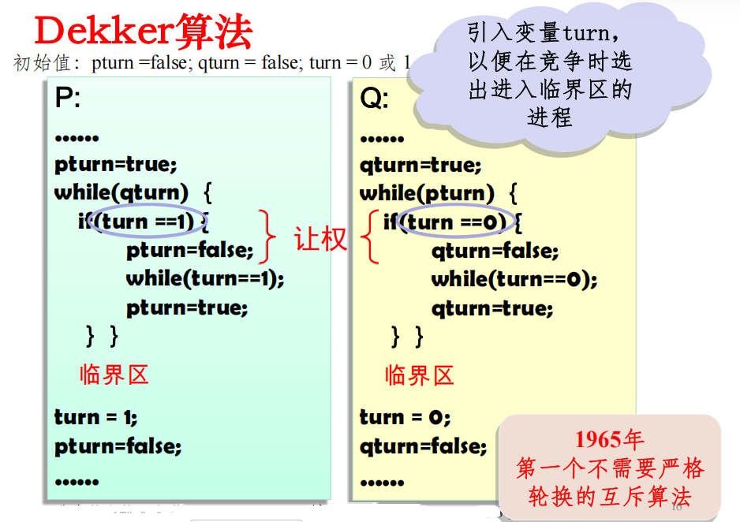
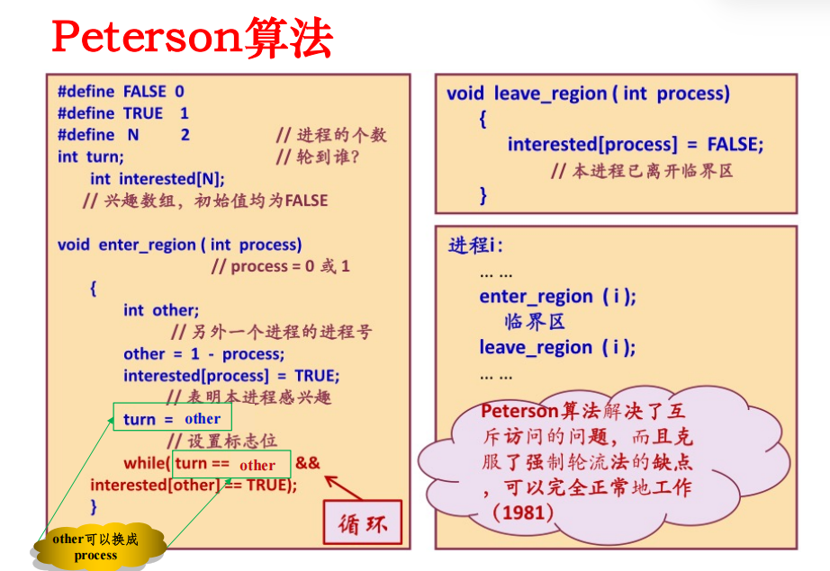
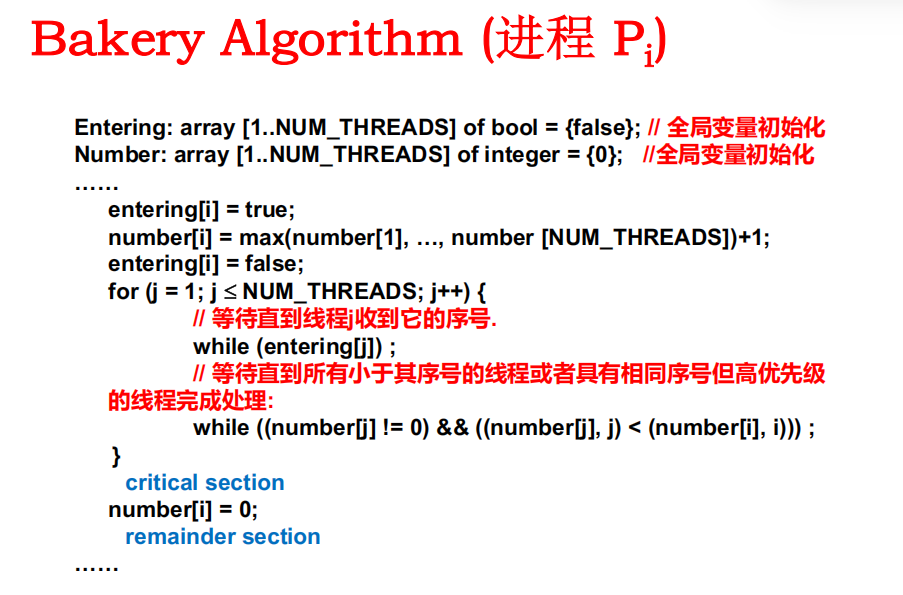

# 同步与互斥

## 问题引入与基础概念

并发是OS的设计基础，也是很多关键问题（如:同步互斥）产生的主要原因。

进程的三个特征：

+ 并发：体现在进程的执行是间断性的；进程的相对执行速度是不可测的。**（间断性）**
+ 共享：体现在进程/线程之间的制约性（如共享打印机）**（非封闭性）**。
+ 不确定性：进程执行的结果与其执行的相对速度有关，是不确定的**（不可再现性）**。

> [!NOTE]
> + 竞争：两个或多个进程对同一共享数据同时进行访问，而最后的结果是不可预测的，它取决于各个进程对共享数据访问的相对次序。
> + 竞争条件：多个进程并发访问和操作同一数据且执行结果与访问的特定顺序有关(违反了Bernstein条件)
> + 临界资源：一次仅允许一个进程访问的资源。（如打印机）
> + 临界区：每个进程中访问临界资源的那段代码称为临界区。

> [!NOTE]
> 在并发执行环境下，进程（或线程）之间常见的问题主要表现为同步与互斥两类：
> **互斥（Mutual Exclusion）：**多个并发进程（或线程）因竞争临界资源而产生的间接制约关系，要求任一时刻只允许一个进程（或线程）进入临界区访问该资源。
> **同步（Synchronization）：**多个并发进程（或线程）之间为了协调执行次序或协作完成任务而建立的直接制约关系，使其按照规定的先后顺序推进。

简单理解可以认为，互斥是因为**争夺临界资源**而发生的（例如使用打印机），同步问题则是描述某些情况下一些进程需要**按照一定的次序**进行（例如生产者先生产产品，消费者才能取产品）

**临界区管理准则：**

+ **空闲让进：**临界资源处于空闲状态，允许进程进入临界区。临界区内仅有一个进程运行。
+ **忙则等待：**临界区有正在执行的进程，所有其他进程则不可以进入临界区。（只有一个能在临界区里）
+ **有限等待：**对要求访问临界区的进程，应保证在有限时间内进入自己的临界区，避免死等。（Bounded Waiting）
+ **让权等待：**当进程（长时间）不能进入自己的临界区时，应立即释放处理机，尽量避免忙等。

以及一个附加条件：当一个进程运行在临界区外面时，不能妨碍其他的进程进入临界区（Progress）

## 基于忙等待的互斥方法

软件方案主要是通过共享变量与循环检测（busy waiting）实现互斥访问

### 软件方案 1：Dekker 算法



`turn` 变量表示发生竞争时优先允许哪一方进入临界区，`pturn` 和 `qturn` 则表明了申请临界区的行为。

运行逻辑：

1. 进程想进入临界区时，先把自己的申请标志设为 true
2. 如果发现对方也想进：
   + 若 turn 指向对方，就暂时撤回申请并等待（让权）
   + 等轮到自己时，再重新申请
3. 当对方不想进，或轮到自己时，就进入临界区
4. 离开临界区后：
    + 把 turn 交给对方
    + 自己申请标志设回 false

**缺陷：** 仅两个进程；代码里有“申请—撤回—再申请—等待 turn”的反复逻辑，理解和维护困难，也容易写错。

### 软件方案 2：Peterson 算法



相比于 Dekker ，它主要改进在于进程申请进入后，主动把优先权交给对方，若对方也申请，则自己等待，即

```c
turn = other;
while(turn == other && interested[other] == TRUE);
```

**说明：** 虽然简化了 Dekker，但是仍然只能支持两个进程互斥

### 软件方案 3：Bakery Algorithm(面包店算法)



其中 `entering[i] = true` 表示进程 i 正在取号，此时其 `number[i]` 尚未稳定，其他进程需等待，它为 true 意味着进程 i 想进入临界区且正在申请编号

**后续流程：**
1. 进程在拥有自己的编号后，会扫描其他所有的进程，对于任意一个其他进程 j ：
    + 如果 j 正在申请编号，则等待
    + 如果 j 没有申请编号，则比对下一个进程
2. 若 i 和 j 都有自己的编号，则按照先编号后进程 id 的规则进行比较，较小的会优先执行，较大的则忙等待
3. 执行临界区后，将 `number[i]` 置 0

**说明：**
1. 编号较小说明更早就在申请，因此情理上更优先
2. 支持多个进程互斥。若仅按进程 id 决定优先级，则小 id 进程可能长期占优；Bakery 通过动态取号机制按申请先后顺序进入，避免饥饿。

------

硬件方案主要是从 CPU 提供原子操作指令的角度解决互斥问题

### 硬件方案 1 ：中断屏蔽

**流程：**
1. 将要进入临界区，执行“关中断”指令
2. 执行临界区
3. 退出临界区之前，执行“开中断”指令

**说明：** 利用单 CPU 系统中，中断是操作系统抢占和调度的重要入口

**优点：** 实现简单

**缺点：**
1. 不适用于多 CPU 系统（即使关了中断其他 CPU 仍然能使用临界资源）
2. 性能损失大，日常很多任务靠中断机制触发
3. 让用户进程使用关中断可能很危险，若不打开会导致整个系统无法继续运行

可以在内核进程少量使用

### 硬件方案 2 ：使用 test_and_set 指令实现自旋锁 Spinlocks

> [!NOTE]
> 原语（Primitive）：由若干条指令所组成的指令序列，来实现某个特定的操作功能（连续不可分割的，OS核心，必须内核态执行，常驻内存）

TS（test-and-set ）是一种**不可中断的基本原语**（指令），返回 lock 当前值以便于检查，并始终把相应量置 1

```
TestAndSet(boolean_ref lock) {
    boolean initial = lock;
    lock = true;
    return initial;
}
```

下面是自旋锁的基本流程：

```
// lock 初始为 0
acquire(lock) {
    while(test_and_set(lock) == 1) /* do nothing */;
}
release(lock) {
    lock = 0;
}
```

第一个进入的进程会将 lock 从 0 原子地改为 1 并获得锁。之后其他进程执行 test_and_set 时读到旧值为 1，说明锁已被占用，只能忙等待，直到持锁者释放锁。

### 基于忙等待的互斥方法总结

**共性问题：**

1. **忙等待:**浪费CPU时间（~~占着茅坑不拉屎~~）
2. **优先级反转：**低优先级进程先进入临界区，高优先级进程一直忙等

**优先级反转示例：**

（调度规则：H 就绪就可以优先运行）

低优先级进程 L 先进入临界区并持有锁，此时高优先级进程 H 就绪并尝试进入临界区。由于锁已被占用，H 只能忙等待；而 L 又可能因调度被换出，无法继续执行并释放锁，导致 H 被长期阻塞。

> [!IMPORTANT]
> **思考：** 如果采用用户级线程实现多线程，是否会发生优先级反转（指一个进程的多个线程）？内核级线程呢？
>
> 提示：进入临界区一般需要系统调用

## 基于信号量的同步方法

**同步实现的基本思路：** 将忙等变为阻塞，用两条进程的通信原语 Sleep 和 Wakeup

但是， Wakeup 信号可能会丢失

### 信号量

信号量是Dijkstra1965年提出的一种方法，它使用一个整型变量来累计唤醒次数，供以后使用。在他的建议中引入了一个新的变量类型，称作信号量（semaphore）

> [!NOTE]
> 关于信号量的两种操作：
> P(S)操作：减少信号量，也叫 semWait
> V(S)操作：增加信号量，也叫 semSignal
> 信号量是一类特殊的变量，对其访问都是原子操作，且只允许上述两种操作

信号量的定义：一个确定的二元组 $(s,q)$ ，其中 $s$ 是一个具有非负初值的整型变量， $q$ 是一个初始状态为空的队列，当发出 P 操作时：

+ $s$ 表示可立即执行的进程的数量
    + 若 $s$ 为正，立即执行
    + 若 $s ≤ 0$ ，阻塞发出 P 操作的进程被阻塞
+ $q$ 表示当前被阻塞的进程，初始为空，进程被阻塞时会被放入

> [!WARNING]
> 在具体信号量实现中，P(s)有不同的实现方式。有的实现中，每调用一次P(s)，s的值均减1。而在有的实现中，调用P(s)时，如果s > 0，s 值减 1；如果s = 0, 则s值不变。在本课笔记中，采用前一种实现方式进行讲解。

信号量的分类：

+ 二元信号量（互斥，$s \in {0,1}$）
+ 一般信号量（初值未可用物理资源总数，用于进程间的协作同步问题）
+ 强信号量（采用 FIFO 释放被阻塞进程）
+ 弱信号量（无规定移除顺序，可能会出现饥饿）

不同进程对信号量的访问仍然会产生竞争，所以不可避免地还会出现忙等待或关中断，但由于只对一个变量进行操作，整个时间非常短

| 应用 | 描述 | 实现提示 |
|------|------|------|
| 互斥 (Mutual exclusion) | 可以用初始值为1的信号量来实现进程间的互斥。一个进程在进入临界区之前执行semWait操作，退出临界区后再执行一个semSignal操作。这是实现临界区资源互斥使用的一个二元信号量。 | Semaphore(1);先P(S)再V(S) |
| 有限并发 (Bounded concurrency) | 指有n（1≤n≤c，c是一个常量）个进程并发执行一个函数或者一个资源。一个初始值为c的信号量可以实现这种并发。 | Semaphore(n);先P(S)再V(S) |
| 进程同步 (Synchronization) | 指当一个进程P想要执行一个a操作时，它只在进程P执行完a后，才会执行a操作。可以用信号量如下实现：将信号量初始为0，P执行a操作前执行一个semWait操作；而P执行a操作后，执行一个semSignal操作。 | barrier = Semaphore(0);mutex =Semaphore(1);mutex用于保护count，barrier用于实现同步 |

屏障（barrier） 是一种低级通信原语，其实现基础方式未

```text
n = the number of threads
count = 0 //到达汇合点的线程数
mutex = Semaphore(1) //保护count
barrier = Semaphore(0)//线程到达之前都是0或者负值，到达后取正值
P(mutex)
count = count + 1
V(mutex)
if count == n: V(barrier) # 唤醒一个线程
P(barrier)
V(barrier) # 一旦线程被唤醒，有责任唤醒下一个线程
```

**优点：** 简单，而且表达能力强（用P.V操作可解决任何同步互斥问题）

**缺点：** 不够安全；P.V操作使用不当会出现死锁；遇到复杂同步互斥问题时实现复杂

## 基于管程（Monitor）的同步与互斥

**信号量及 PV 操作的问题：**信号量机制具有一些缺点，比如说用信号量及PV 操作解决问题的时候程序编写需要很高的技巧。

• **如果没有合理地安排 PV 操作的位置，就会导**

**致一些出错的结果，例如：出现死锁等问题。**

§ **管程是在程序设计语言当中引入的一种高级**

**同步机制。**


## 进程通信的主要方法

### 管道


## 经典的进程同步与互斥问题

### 生产者-消费者问题

**实例：** 寿司流水席

**问题描述：** 若干进程通过有限的共享缓冲区交换数据。其中，“生产者”进程不断写入，而“消费者”进程不断读出；共享缓冲区共有N个；任何时刻只能有一个进程可对共享缓冲区进行操作。

